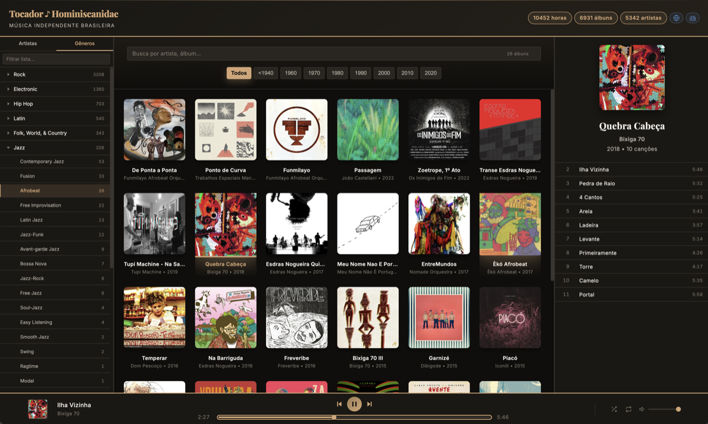

# Tocador

Um player web para acervos musicais. Aponte para qualquer arquivo `.json.gz` compatível e toque — sem build, sem dependências pesadas, funciona em qualquer CDN estática.

> **Tocador é uma plataforma** — o mesmo player reproduz muitos acervos diferentes. Cada acervo é um catálogo independente apontado via `?acervo=`.

<p align="center">
  <a href="https://tocador.cc/">
    
  </a>
</p>

[](https://tocador.cc/radio?acervo=homi)

## 📻 Rádio

O Tocador tem um modo rádio standalone em [`radio.html`](radio.html) — um widget minimalista que toca faixas aleatórias de qualquer acervo, sem a interface completa do player.

```
https://tocador.cc/radio?acervo=homi
https://tocador.cc/radio?acervo=uqt
```

### Embed

Cole em qualquer página para incorporar a rádio:

```html
<iframe
  src="https://tocador.cc/radio"
  width="328"
  height="355"
  frameborder="0"
></iframe>
```

- Toca aleatoriamente por todo o acervo — álbuns e faixas
- Avança automaticamente ao terminar cada faixa ou em caso de erro
- Histórico de navegação: botão anterior volta à faixa tocada antes
- Capa do álbum, artista, álbum e ano exibidos em tempo real com marquee animado
- Barra de progresso clicável
- Clique no artista ou álbum para abrir no player principal

## 🆕 Novidades recentes

- **Painel de navegação (Browse)**: filtre por gênero (árvore com expand/collapse) ou por artista — contagem em tempo real e botão de limpar
- **Rádio com relatório de erros**: faixas que falham são reportadas automaticamente como issues no GitHub
- **Ordenação de artistas**: ordem alfabética por locale pt-BR — letras antes de números e símbolos
- **Animação de entrada**: cards de álbum expandem ao entrar no viewport
- **Ocultar artista no card**: ao filtrar por artista, o nome some dos cards para reduzir ruído visual
- **Sitemap.xml**: gerado automaticamente pelo `generate-albums` para indexação por buscadores
- **Scripts de enriquecimento**: `enrich-singles-audd` (reconhecimento de áudio via AudD) e `fix-singles-itunes` (metadados de singles via iTunes)
- **Cache .gz com ETag**: invalidação instantânea do catálogo ao fazer deploy sem quebrar cache do browser

## ✨ Características

### 🎨 Interface Spotify-Style Grid
- **Grid de álbuns central**: Grade responsiva de capas com rolagem virtual — apenas ~30 cards no DOM independente do tamanho da biblioteca
- **Painel de faixas lateral**: Clique em um álbum para exibir capa grande, info e lista de faixas
- **Capas lazy-loaded**: Carregadas sob demanda com placeholder SVG embutido — sem impacto no carregamento inicial
- **Player compacto**: Barra sticky no rodapé com controles de play/pausa/próxima, progresso e stats da biblioteca

### 🔍 Busca e Filtros Inteligentes
- **Links compartilháveis por faixa**: URL inclui `?album=...&t=N` — compartilhe um álbum ou uma faixa específica; adicione `&play=1` para que o áudio inicie automaticamente ao abrir o link
- **Busca em tempo real**: Filtre por nome do artista, álbum ou qualquer metadado — com debounce de 150ms
- **Botão de limpar** (✕): Aparece no campo de busca ao digitar; limpa e reposiciona o foco
- **Contagem de resultados**: Exibe quantos álbuns correspondem ao filtro ativo
- **Filtro por década**: Botões compactos (Todos | <1940 | 1950 … 2010) — clique para explorar épocas; linha única com scroll horizontal no mobile
- **Filtros combinados**: Use busca + década juntos para encontrar exatamente o que procura

### ♿ Acessibilidade
- **Navegação por teclado**: todos os elementos interativos (álbuns, faixas, links de artista/ano, controles do player) alcançáveis via Tab e ativáveis com Enter/Espaço
- **Leitor de tela**: `aria-label` em todos os botões de ícone; `aria-pressed` em shuffle e repeat; `aria-expanded` no drawer de faixas; `role="slider"` com `aria-valuenow` atualizado em tempo real na barra de progresso
- **Anúncio automático de faixa**: região `aria-live="polite"` anuncia "Reproduzindo: [faixa] — [artista]" a cada troca sem que o usuário precise navegar
- **HTML semântico**: filtro de décadas como `<nav>`, grid de álbuns com `role="list"`, campo de busca com `<label>` visualmente oculto
- **Focus-visible**: estilo de foco explícito em todos os elementos interativos — distinguível do foco por mouse

### 📱 Totalmente Responsivo
- **Desktop**: Layout lado-a-lado (grid de álbuns + painel de faixas lateral com auto-scroll para a faixa tocando)
- **Mobile**: Grid de álbuns em tela cheia; painel de faixas como drawer deslizante no player (☰ à direita); shuffle (à esquerda) e controles centrais na barra do player; header compacto com stats visíveis

### 🎼 Funcionalidades de Áudio
- **Seleção intencional**: Clique em um álbum para carregá-lo no player — o áudio só começa ao pressionar play
- **Auto-play da próxima**: Continua automaticamente para a próxima faixa ao final
- **Barra de progresso estilo Spotify**: Linha fina com ponto de posição sempre visível; cresce levemente no hover; área de toque ampla para mobile
- **Controle de progresso**: Clique (ou toque) na barra para pular para qualquer ponto
- **Shuffle**: Embaralha a ordem das faixas do álbum atual
- **Repeat**: Cicla entre três modos — sem repetição → repetir faixa → repetir álbum
- **Volume**: Slider de volume no player (desktop)
- **Persistência**: Shuffle, modo de repetição e volume são salvos no `localStorage` e restaurados ao reabrir
- **Atalhos de teclado**: `Espaço` play/pausa · `←/→` recua/avança 10s · `n` próxima · `p` anterior

## 📦 Acervos

O Tocador usa `?acervo=` para saber qual catálogo carregar:

```
https://tocador.cc/?acervo=<alias_ou_url>
```

Pode ser um **alias pré-configurado** ou uma **URL direta** para qualquer `.json.gz` compatível. Uma vez carregado, o acervo persiste na sessão — recarregar sem o parâmetro mantém o mesmo.

### Aliases prontos

| alias | acervo |
|---|---|
| `?acervo=uqt` | Acervo UQT — MPB, samba, bossa nova |
| `?acervo=homi` | Acervo Homi |

### Acervo externo

```
?acervo=https://exemplo.com/meu-acervo.json.gz
```

Qualquer URL pública para um `.json.gz` no formato correto funciona diretamente.

## 🗂️ Formato do acervo

Um `.json.gz` com esta estrutura:

```json
{
  "meta": {
    "title": "Meu Acervo",
    "subtitle": "Subtítulo",
    "hours": "42",
    "base_url": "https://cdn.exemplo.com/musicas"
  },
  "albums": [
    {
      "title": "Nome do Álbum",
      "artist": "Artista",
      "year": 1975,
      "path": "1975 - Artista - Nome do Álbum",
      "has_cover": true,
      "tracks": [
        {
          "title": "Nome da Faixa",
          "num": 1,
          "file": "01 Nome da Faixa.mp3",
          "artists": "Artista",
          "duration": 214
        }
      ]
    }
  ]
}
```

`base_url + "/" + path + "/" + file` → URL do áudio  
`base_url + "/" + path + "/capa-min.jpg"` → capa do álbum

## 🛠️ Criar um acervo

Veja [`script/README.md`](script/README.md) para o guia completo em pt-BR:

```bash
# 1. Gerar catálogo de álbuns a partir dos MP3s locais
ARCHIVE_DIR=/path/to/musicas bun script/generate-albums.js

# 2. Sincronizar áudio para o bucket S3
ARCHIVE_DIR=/path/to/musicas bun script/sync-to-bucket.js

# 3. Redimensionar e fazer upload das capas (200px)
ARCHIVE_DIR=/path/to/musicas bun script/resize-cover-images.js
```

### Arquitetura
- **Player** (`index.html`): HTML5 + CSS3 + JavaScript vanilla — servido pelo GitHub Pages ou qualquer CDN estática
- **Rádio** (`radio.html`): Widget standalone, mesmo acervo, interface mínima
- **Dados**: `.json.gz` — catálogo gzipado carregado assincronamente e descomprimido via `DecompressionStream` nativa do browser
- **Capas e áudio**: Servidos pelo `base_url` definido em cada acervo
- **Proxy** (`proxy.js`): Bun + `Bun.S3Client` nativo atrás de nginx com cache de imagens em disco

### Fluxo de uma requisição
1. Browser carrega `index.html` do GitHub Pages
2. `ui.js` lê `?acervo=` da URL, resolve alias ou URL direta, faz fetch do catálogo gzipado e renderiza o grid
3. Ao clicar num álbum, constrói a URL `{base_url}/{path}/{file}`
4. Browser faz `GET` direto ao servidor de mídia — ou via proxy, se o acervo usar armazenamento privado

### Frontend
- Dependências mínimas: Umbrella JS (~2.6 KB); descompressão gzip via `DecompressionStream` nativa (zero KB extra)
- CSS com Flexbox, sem frameworks; grid substituído por posicionamento absoluto virtual
- Placeholder de capa embutido como data-URI (nenhum round-trip extra)
- Delegação de eventos: 3 listeners no total para álbuns, faixas e drawer mobile

## 💡 Dicas de Uso

### Exploração Rápida
1. Use os **botões de década** para navegar por época
2. **Clique em qualquer álbum** para ver todas as faixas
3. Clique em uma faixa para **começar a tocar**

## 🎯 Otimizações de Performance

### Carregamento de dados
- **Gzip assíncrono**: catálogo carregado via `fetch` + `DecompressionStream` nativa — elimina MB de JS bloqueante no parse inicial
- **Virtual scrolling**: `VirtualGrid` renderiza ~30 cards em posicionamento absoluto; scroll event passivo + ResizeObserver — DOM nunca passa de ~100 nós
- **Event delegation**: 3 listeners delegados substituem centenas de listeners individuais por álbum
- **Track list diffing**: `renderTrackList()` detecta se o álbum já está renderizado — ao trocar faixa no mesmo álbum, só atualiza `.playing` sem reconstruir o DOM

### DOM e JavaScript
- **Refs em módulo**: 9 elementos hot-path inicializados uma vez no `DOMContentLoaded` — `updateNowPlaying()` e `setLoading()`, chamados a cada faixa, fazem zero `getElementById`
- **Shuffle O(1) sem alocação**: caminhada aleatória ponderada por peso de faixas — escolhe álbum em O(nAlbums), faixa em O(1), zero alocações
- **indexOf vs findIndex**: comparação por identidade sem closure na navegação de faixas
- **CSS deduplicado**: blocos `@media` e seletores duplicados merged em bloco único

### Streaming e Deployment
- **Servidor de mídia**: `Range` suportado para seek/streaming eficiente
- **Capas**: `capa-min.jpg` (200px wide) — geradas por `script/resize-cover-images.js`
- **Lazy loading**: zero impacto no carregamento inicial
- **Cache-Control em camadas**: capas com `immutable`; áudio com cache longo; catálogo JSON com TTL curto
- **Nginx + cache de imagens**: capas cacheadas em disco por 30 dias — `proxy_cache_lock` evita thundering herd (centenas de requisições simultâneas para a mesma capa fazem apenas uma chamada ao S3)
- **Deployment**: Haloy + Docker (nginx + Bun no mesmo container), rolling updates sem downtime

## 🤝 Contribuições

Para sugerir melhorias ou adicionar suporte a novos acervos:
1. Abra uma [issue](https://github.com/rafapolo/tocador/issues)
2. Ou submeta um [pull request](https://github.com/rafapolo/tocador/pulls)

---

**Feito para tocar** ♪

[Demo ao vivo →](https://tocador.cc/)
