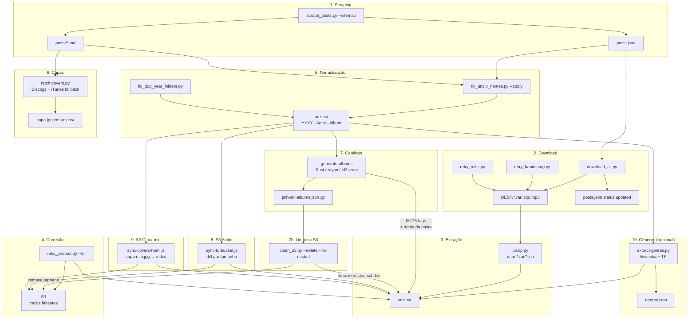

# Pipeline Hominiscanidae

## Fluxo resumido

| # | Etapa | Entrada | Saída | Ferramentas |
|---|-------|---------|-------|-------------|
| 1 | **Scrape** | sitemap.xml | `posts.json`, `posts/*.md` | requests, BS4, html2text |
| 2 | **Download** | `posts.json` | arquivos em `/Volumes/EXTRA/hominiscanidae/` | megadl, aria2c, gdown, yt-dlp |
| 3 | **Extração** | `.rar/.zip/.7z` | pastas em `unzips/` | unar (preserva acentos PT-BR) |
| 4 | **Charset gap** | álbuns com tracks faltando em `unzips/` | tracks copiadas + upload S3 | megadl, yt-dlp, boto3 |
| 5 | **Nome normalize** | pastas `unzips/` sem ano | `YYYY - Artist - Album` | regex, fuzzy match de slugs |
| 6 | **Capas** | pastas sem imagem | `capa.jpg` + `capa-min.jpg` na pasta | requests, PIL, Discogs API, iTunes API |
| 7 | **Catálogo** | `unzips/` | `js/homi-albums.json.gz` | Rust (id3, rayon, walkdir) |
| 7b | **Limpeza S3** | `homi-albums.json.gz` + S3 | orphans removidos, nested subdirs removidos | `scripts/utils/clean_s3.py` |
| 8 | **S3 audio** | `unzips/` | `s3://$S3_BUCKET/indie/<album>/` | @aws-sdk/lib-storage, diff por tamanho |
| 9 | **S3 capa-min** | `unzips/` | `s3://$S3_BUCKET/indie/<album>/capa-min.jpg` | sync-covers-homi.js |
| 10 | **Gêneros** | `unzips/` | `genres.json` | Essentia + TF (discogs400/dortmund) |

## Observações

- **ID3 tags**: O binary `generate-albums` *lê* tags ID3 de título/artista/álbum/ano/faixa/duração para preencher metadados. O nome da pasta tem prioridade sobre ID3 (preenche lacunas).
- **capa-min.jpg**: `fetch-covers.py` grava `capa.jpg` (q92) e `capa-min.jpg` (200px, q80) localmente; `sync-covers-homi.js` sobe os `capa-min.jpg` já existentes para S3. Não há conversão para WebP.
- **S3 bucket**: definido via `$S3_BUCKET` no `.env`. Prefixo `indie/` para audio e capas do hominiscanidae; `uqt/` é o prefixo do acervo uqt (outro pipeline).
- **Ordenação**: O catálogo final ordena álbuns por ano decrescente. Tracks dentro de cada álbum seguem a ordem alfabética dos nomes de arquivo.
- **Merge de cópias**: Pastas com sufixo ` (2)`, ` (3)` etc. são mergeadas no álbum base durante a geração do catálogo.
- **Limpeza S3**: `clean_s3.py` cruza as pastas do bucket com o `homi-albums.json.gz` (comparação NFC) e remove orphans — duplicatas `(2)/(3)`, compilações antigas, nomes divergentes. Também detecta subdirs aninhados em `unzips/` que causam caminhos com `/` no acervo. Roda em dry-run por padrão; use `--delete --fix-nested` para aplicar.
